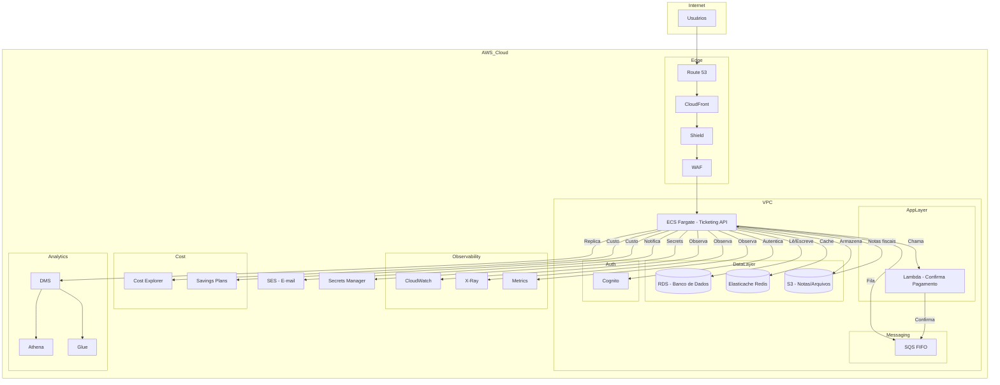

# Ticketing

Sistema de gerenciamento de reservas, pagamentos e produtos para eventos e sessões de cinema/teatro, desenvolvido em Java com Spring Boot.

## Sobre o Desafio Técnico

Este projeto foi desenvolvido como solução para o desafio técnico da vaga de Engenheiro(a) de Software, cujo objetivo era propor uma arquitetura na AWS e implementar um sistema de bilhetagem funcional, conforme o case abaixo:

> O sistema deve permitir solicitação, reserva e compra de ingressos, além de oferecer produtos adicionais (pipoca, chocolate, refrigerante, etc.) durante o processo de compra. A solução deve conter uma única base de código, mesmo que a arquitetura proposta seja orientada a microserviços.

**Entregas do desafio:**
- Desenho de arquitetura AWS (anexado/documentado)
- Código-fonte funcional (este repositório)
- Instruções claras de execução e testes
- Documentação das decisões técnicas

**Principais decisões técnicas:**
- Utilização de Java + Spring Boot para rápida prototipação, robustez e familiaridade do stack
- Estrutura modularizada por domínio (usuário, evento, sessão, produto, reserva, pagamento)
- Cobertura de testes unitários para controllers, services, DTOs, entidades e exceptions
- Projeto pronto para deploy em nuvem (AWS), com persistência desacoplada e fácil adaptação para bancos gerenciados
- Documentação automática da API via Swagger/OpenAPI

Para mais detalhes sobre a arquitetura AWS sugerida, consulte o diagrama e a seção de decisões técnicas ao final deste README.

## Visão Geral
O Ticketing é uma API RESTful que permite:
- Gerenciar usuários, sessões, eventos e produtos
- Realizar reservas de assentos
- Efetuar pagamentos
- Consultar status de reservas e pagamentos

## Arquitetura
- **Spring Boot**: Framework principal
- **Controllers**: Camada de entrada da API (REST)
- **Services**: Lógica de negócio
- **DTOs**: Objetos de transferência de dados (Request/Response)
- **Entities**: Mapeamento das entidades do domínio
- **Repositories**: Integração com banco de dados (JPA)
- **Exceptions**: Tratamento global e customizado de erros

## Estrutura de Pastas
```
src/
  main/
    java/com/example/Ticketing/
      Controller/         # Controllers REST
      Service/            # Serviços de negócio
      Model/
        DTO/              # DTOs de Request/Response
        Entity/           # Entidades JPA
        Enum/             # Enums do domínio
      Repository/         # Interfaces JPA
      Exception/          # Exceções customizadas e handler global
    resources/
      application.properties # Configurações da aplicação
      data.sql               # Dados iniciais (opcional)
  test/
    java/com/example/Ticketing/
      ...                   # Testes unitários para todas as camadas
```

## Tecnologias Utilizadas
- Java 17+
- Spring Boot
- Spring Data JPA
- Lombok
- H2 Database (dev/test)
- JUnit 5 & Mockito (testes)
- Swagger/OpenAPI (documentação)

## Como Executar
1. **Pré-requisitos:**
   - Java 17+
   - Maven 3.8+

2. **Build do projeto:**
   ```sh
   ./mvnw clean install
   ```
   ou no Windows:
   ```sh
   mvnw.cmd clean install
   ```

3. **Executar a aplicação:**
   ```sh
   ./mvnw spring-boot:run
   ```
   ou
   ```sh
   java -jar target/Ticketing-0.0.1-SNAPSHOT.jar
   ```

4. **Acessar a documentação da API:**
   - Swagger UI: [http://localhost:5050/swagger-ui.html](http://localhost:5050/swagger-ui.html)

## Testes
- Para rodar todos os testes unitários:
  ```sh
  ./mvnw test
  ```
- Os testes cobrem controllers, services, DTOs, entidades e exceptions.

## Exemplos de Endpoints
- **Criar reserva:**
  ```http
  POST /reservations
  {
    "userId": 1,
    "sessionId": 100,
    "seatCount": 2,
    "products": [1,2]
  }
  ```
- **Efetuar pagamento:**
  ```http
  POST /payments
  {
    "reservationId": 5001,
    "paymentMethod": "CREDIT_CARD"
  }
  ```
- **Consultar reservas do usuário:**
  ```http
  GET /users/1/reservations
  ```

## Endpoints da API

### Usuários
- **Criar usuário**
  - `POST /users`
  - Request: `{ "name": "João", "email": "joao@email.com", ... }`
  - Response: 201 Created, retorna dados do usuário criado
- **Buscar usuário por ID**
  - `GET /users/{id}`
  - Response: 200 OK, retorna dados do usuário
- **Listar reservas do usuário**
  - `GET /users/{id}/reservations`
  - Response: 200 OK, lista de reservas

### Sessões
- **Listar sessões**
  - `GET /sessions`
  - Response: 200 OK, lista de sessões disponíveis
- **Buscar sessão por ID**
  - `GET /sessions/{id}`
  - Response: 200 OK, dados da sessão

### Eventos
- **Listar eventos**
  - `GET /events`
  - Response: 200 OK, lista de eventos
- **Buscar evento por ID**
  - `GET /events/{id}`
  - Response: 200 OK, dados do evento

### Produtos
- **Listar produtos**
  - `GET /products`
  - Response: 200 OK, lista de produtos
- **Buscar produto por ID**
  - `GET /products/{id}`
  - Response: 200 OK, dados do produto

### Reservas
- **Criar reserva**
  - `POST /reservations`
  - Request: `{ "userId": 1, "sessionId": 100, "seatCount": 2, "products": [1,2] }`
  - Response: 201 Created, dados da reserva
- **Buscar reserva por ID**
  - `GET /reservations/{id}`
  - Response: 200 OK, dados da reserva
- **Cancelar reserva**
  - `DELETE /reservations/{id}`
  - Response: 204 No Content

### Pagamentos
- **Efetuar pagamento**
  - `POST /payments`
  - Request: `{ "reservationId": 5001, "paymentMethod": "CREDIT_CARD" }`
  - Response: 201 Created, dados do pagamento
- **Buscar pagamento por ID**
  - `GET /payments/{id}`
  - Response: 200 OK, dados do pagamento

### Respostas de Erro
- Erros são retornados no padrão:
  ```json
  {
    "timestamp": "2025-06-18T16:00:00",
    "status": 400,
    "error": "Bad Request",
    "message": "Detalhes do erro",
    "path": "/reservations"
  }
  ```

Consulte a documentação Swagger para detalhes completos de cada endpoint, parâmetros e exemplos de resposta.

## Observações
- O projeto utiliza Lombok para reduzir boilerplate. Certifique-se de que seu IDE está com o plugin Lombok habilitado.
- O banco H2 é utilizado apenas para desenvolvimento/testes. Para produção, configure outro banco em `application.properties`.

## Contribuição
Pull requests são bem-vindos! Para contribuir:
1. Fork este repositório
2. Crie uma branch (`git checkout -b feature/nome-feature`)
3. Commit suas alterações (`git commit -am 'feat: nova feature'`)
4. Push para a branch (`git push origin feature/nome-feature`)
5. Abra um Pull Request

## Licença
Este projeto está sob a licença MIT.

## Entidades JPA e Relacionamentos

O projeto Ticketing utiliza entidades JPA para mapear as tabelas do domínio e seus relacionamentos. Veja abaixo um resumo das principais entidades e como elas se conectam:

### User
- **Atributos:** id, name, email, createdAt
- **Relacionamentos:**
  - Um usuário pode ter várias reservas (`OneToMany` implícito, mapeado em Reservation com `@ManyToOne`).

### Event
- **Atributos:** id, name, createdAt, updatedAt
- **Relacionamentos:**
  - Um evento pode ter várias sessões (`OneToMany` implícito, mapeado em Session com `@ManyToOne`).

### Session
- **Atributos:** id, name, startTime, createdAt, updatedAt
- **Relacionamentos:**
  - Muitas sessões pertencem a um evento (`@ManyToOne Event`).
  - Uma sessão pode ter várias reservas (`OneToMany` implícito, mapeado em Reservation).

### Product
- **Atributos:** id, name, price, createdAt
- **Relacionamentos:**
  - Um produto pode estar em várias reservas e uma reserva pode ter vários produtos (`@ManyToMany`).

### Reservation
- **Atributos:** id, seatCount, createdAt, status
- **Relacionamentos:**
  - Muitas reservas pertencem a um usuário (`@ManyToOne User`).
  - Muitas reservas pertencem a uma sessão (`@ManyToOne Session`).
  - Uma reserva pode ter vários produtos (`@ManyToMany Product`).
  - Uma reserva tem um pagamento (`@OneToOne Payment`).

### Payment
- **Atributos:** id, method, idempotencyKey, transactionId, amount, createdAt, status
- **Relacionamentos:**
  - Um pagamento está associado a uma reserva (`@OneToOne Reservation`).

### Diagrama Resumido dos Relacionamentos

```
User 1---* Reservation *---1 Session *---1 Event
              |
              *---* Product
              |
              1---1 Payment
```

- **User** faz muitas **Reservation**
- **Reservation** pertence a um **User** e a uma **Session**
- **Session** pertence a um **Event**
- **Reservation** pode ter muitos **Product** (e vice-versa)
- **Reservation** tem um **Payment**

## Arquitetura AWS Proposta

### Resumo Explicativo

A arquitetura do sistema de bilhetagem foi desenhada para garantir escalabilidade, segurança, performance e observabilidade, utilizando os seguintes serviços AWS:

- **VPC**: Isolamento de rede para todos os recursos.
- **ECS (Fargate)**: Execução da aplicação em containers, facilitando deploy e escalabilidade.
- **RDS**: Banco de dados relacional para persistência das informações do sistema.
- **Elasticache Redis**: Cache para dados estáticos e de cadastro, acelerando consultas.
- **S3**: Armazenamento de arquivos, como notas fiscais e relatórios.
- **CloudFront**: Distribuição de conteúdo estático com baixa latência.
- **Route 53**: Gerenciamento de DNS.
- **AWS Shield e WAF**: Proteção contra ataques DDoS e tentativas de fraude.
- **Cognito**: Autenticação e gerenciamento de usuários.
- **SQS FIFO**: Fila para processamento assíncrono e ordenado (ex: confirmação de pagamentos).
- **Lambda**: Funções serverless para integração com sistemas externos e automações.
- **SES**: Envio de e-mails transacionais (notificações).
- **CloudWatch, X-Ray, Metrics**: Monitoramento, rastreamento e observabilidade.
- **Cost Explorer, Savings Plans**: Controle e otimização de custos.
- **Secrets Manager**: Gerenciamento seguro de segredos e credenciais.
- **DMS, Athena, Glue**: Replicação, ETL e análise de dados.
- **TTL em reservas**: Expiração automática de pedidos de reserva (ex: 15 minutos).

### Diagrama Mermaid (Revisado)



> O diagrama acima apresenta as principais camadas e integrações da solução AWS para o sistema de bilhetagem.
